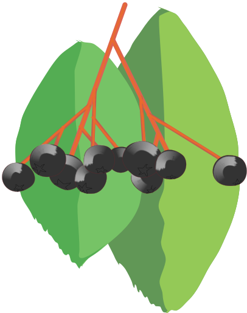

[![npm version][npm-shield]][npm-url]
[![MIT License][license-shield]][license-url]


<!-- PROJECT LOGO -->
<br />
<p align="center">
  

  <h3 align="center">RussianNounsJS</h3>

  <p align="center">
    A JavaScript library that declines nouns.
    <br />
    <br />
    <a href="https://georgy7.github.io/RussianNounsJS/">View Demo</a>
    ·
    <a href="https://georgy7.github.io/RussianNounsJS/testing.html">Run Tests</a>
    ·
    <a href="https://github.com/georgy7/RussianNounsJS/issues">Report Bug</a>
    ·
    <a href="https://github.com/georgy7/RussianNounsJS/wiki">Wiki</a>
  </p>
</p>


<!-- TABLE OF CONTENTS -->
<details open="open">
  <summary>Table of Contents</summary>
  <ol>
    <li>
      <a href="#installation">Installation</a>
      <ul>
        <li><a href="#frontend">Frontend</a></li>
        <li><a href="#backend">Backend</a></li>
      </ul>
    </li>
    <li>
      <a href="#usage">Usage</a>
      <ul>
        <li><a href="#the-basics">The basics</a></li>
        <li><a href="#stress-dictionary-tuning">Stress dictionary tuning</a></li>
        <li><a href="#a-complex-example">A complex example</a></li>
      </ul>
    </li>
    <li><a href="#limitations">Limitations</a></li>
    <li><a href="#references">References</a></li>
  </ol>
</details>


## Installation

### Frontend

```html
<script src="RussianNouns.js"></script>
```

or (without [AMD](https://en.wikipedia.org/wiki/Asynchronous_module_definition))

```html
<!-- from the same domain -->
<script type="module" src="myscript.js"></script>
```

```js
import 'RussianNouns.js';
```

or (in a Web Worker)

```js
importScripts('RussianNouns.js');
```

### Backend

```
npm i --save russian-nouns-js
```

```js
const RussianNouns = require('russian-nouns-js');
```

For TypeScript, there are
[type definitions](https://www.npmjs.com/package/@types/russian-nouns-js)
[written by Alexander Semin](https://github.com/RusAnonym/DefinitelyTyped/tree/master/types/russian-nouns-js).

## Usage

### The basics

```js
RussianNouns.CASES;
// [
//     "именительный",
//     "родительный",
//     "дательный",
//     "винительный",
//     "творительный",
//     "предложный",
//     "местный"
// ]

// Grammatical gender is a noun class system in Russian.
RussianNouns.Gender;
// {
//     FEMININE: "женский",
//     MASCULINE: "мужской",
//     NEUTER: "средний",
//     COMMON: "общий"
// }

const rne = new RussianNouns.Engine();

rne.decline({text: 'имя', gender: 'средний'}, 'родительный');
// [ "имени" ]

rne.decline({text: 'имя', gender: 'средний'}, 'творительный');
// [ "именем" ]

const Gender = RussianNouns.Gender;
const Case = RussianNouns.Case;

let coat = RussianNouns.createLemma({
    text: 'пальто',
    gender: Gender.NEUTER,
    indeclinable: true
});

rne.decline(coat, Case.GENITIVE);
// [ "пальто" ]

RussianNouns.getDeclension(coat);
// -1

let mountain = RussianNouns.createLemma({
    text: 'гора',
    gender: Gender.FEMININE
});

RussianNouns.CASES.map(c => {
    return rne.decline(mountain, c);
});
// [
//     ["гора"]
//     ["горы"]
//     ["горе"]
//     ["гору"]
//     ["горой", "горою"]
//     ["горе"],
//     ["горе"]
// ]

rne.pluralize(mountain);
// [ "горы" ]

RussianNouns.CASES.map(c => {
    return rne.decline(mountain, c, 'горы');
});

// [ 
//     [ 'горы' ]
//     [ 'гор' ]
//     [ 'горам' ]
//     [ 'горы' ]
//     [ 'горами' ]
//     [ 'горах' ]
//     [ 'горах' ]
// ]

RussianNouns.getDeclension(mountain);
// 2

RussianNouns.getSchoolDeclension(mountain);
// 1

let way = RussianNouns.createLemma({
    text: 'путь',
    gender: Gender.MASCULINE
});

RussianNouns.getDeclension(way);
// 0

let scissors = RussianNouns.createLemma({
    text: 'ножницы',
    pluraleTantum: true
});

rne.pluralize(scissors);
// [ 'ножницы' ]

RussianNouns.CASES.map(c => {
    return rne.decline(scissors, c);
});
// [
//     [ 'ножницы' ]
//     [ 'ножниц' ]
//     [ 'ножницам' ]
//     [ 'ножницы' ]
//     [ 'ножницами' ]
//     [ 'ножницах' ]
//     [ 'ножницах' ] 
// ]
```

### Stress dictionary tuning

```js
let кринж = RussianNouns.createLemma({
    text: 'кринж',
    gender: Gender.MASCULINE
});

const rne = new RussianNouns.Engine();

rne.decline(кринж, Case.INSTRUMENTAL);  // [ "кринжем" ]

// Change of stresses.
// Before the hyphen, there are singular settings.
// After the hyphen are the plural settings.
// The letter number in the settings is the case number in CASES.
// S — Stress is on the stem only.
// s — Stress is more often on the stem.
// b — Stress can be both on the stem and the ending equally.
// e — Stress is more often on the ending.
// E — Stress is on the ending only.
rne.sd.put(кринж, 'SEESESE-EEEEEE');

rne.decline(кринж, Case.INSTRUMENTAL);  // [ "кринжом" ]

rne.sd.put(кринж, 'SEESbSE-EEEEEE');
rne.decline(кринж, Case.INSTRUMENTAL);  // [ "кринжем", "кринжом" ]

rne.sd.put(кринж, 'SEESsSE-EEEEEE');
rne.decline(кринж, Case.INSTRUMENTAL);  // [ "кринжем", "кринжом" ]

rne.sd.put(кринж, 'SEESeSE-EEEEEE');
rne.decline(кринж, Case.INSTRUMENTAL);  // [ "кринжом", "кринжем" ]
```

### A complex example

```js
const rne = new RussianNouns.Engine();

const Ⰳ = (word, caseNumber) => {
    const c = RussianNouns.CASES[caseNumber - 1];
    return rne.decline(word, c)[0];
};

const Ⰴ = (word, caseNumber) => {
    const c = RussianNouns.CASES[caseNumber - 1];
    const result = rne.decline(word, c);
    return result[result.length - 1];
};

const ⰃⰃ = (word, caseNumber) => {
    const c = RussianNouns.CASES[caseNumber - 1];
    const pluralForm = rne.pluralize(word)[0];
    return rne.decline(word, c, pluralForm)[0];
};

const L = RussianNouns.createLemma;
const Gender = RussianNouns.Gender;
const cap = (str) => str[0].toUpperCase() + str.substring(1);

// -----------------------------------------------

// Александр Сергеевич Пушкин
// Зимний вечер (фрагмент)

const буря = L({text: 'буря', gender: Gender.FEMININE});
const мгла = L({text: 'мгла', gender: Gender.FEMININE});
const небо = L({text: 'небо', gender: Gender.NEUTER});
const вихрь = L({text: 'вихрь', gender: Gender.MASCULINE});

const зверь = L({text: 'зверь', gender: Gender.MASCULINE, animate: true});
const дитя = L({text: 'дитя', gender: Gender.NEUTER, animate: true});

const кровля = L({text: 'кровля', gender: Gender.FEMININE});
const солома = L({text: 'солома', gender: Gender.FEMININE});

const путник = L({text: 'путник', gender: Gender.MASCULINE, animate: true});
const окошко = L({text: 'окошко', gender: Gender.NEUTER});

console.log(`${cap(Ⰳ(буря, 1))} ${Ⰴ(мгла, 5)} ${Ⰳ(небо, 4)} кроет,
${cap(ⰃⰃ(вихрь, 4))} снежные крутя;
То, как ${Ⰳ(зверь, 1)}, она завоет,
То заплачет, как ${Ⰳ(дитя, 1)},
То по ${Ⰳ(кровля, 3)} обветшалой
Вдруг ${Ⰳ(солома, 5)} зашумит,
То, как ${Ⰳ(путник, 1)} запоздалый,
К нам в ${Ⰳ(окошко, 4)} застучит.`);

// Буря мглою небо кроет,
// Вихри снежные крутя;
// То, как зверь, она завоет,
// То заплачет, как дитя,
// То по кровле обветшалой
// Вдруг соломой зашумит,
// То, как путник запоздалый,
// К нам в окошко застучит.

// -----------------------------------------------

// Николай Степанович Гумилев
// Рассказ девушки (фрагмент)

const ворота = L({text: 'ворота', pluraleTantum: true});
const тень = L({text: 'тень', gender: Gender.FEMININE});
const ель = L({text: 'ель', gender: Gender.FEMININE});
const снег = L({text: 'снег', gender: Gender.MASCULINE});
const высота = L({text: 'высота', gender: Gender.FEMININE});

console.log(`* * *
Я отдыхала у ${ⰃⰃ(ворота, 2)}
Под ${Ⰳ(тень, 5)} милой, старой ${Ⰳ(ель, 2)},
А надо мною пламенели
${cap(ⰃⰃ(снег, 1))} неведомых ${ⰃⰃ(высота, 2)}.`);

// * * *
// Я отдыхала у ворот
// Под тенью милой, старой ели,
// А надо мною пламенели
// Снега неведомых высот.
```

## Limitations

This library does not prevent you from misusing the [singularia tantum](https://en.wikipedia.org/wiki/Plurale_tantum#Singulare_tantum).

## References
- Современный русский язык. Морфология - Камынина А.А., Уч. пос. 1999 - 240 с.
- [Russian grammar (English Wikipedia)](http://en.wikipedia.org/wiki/Russian_grammar)
- [OpenCorpora (Russian text corpus)](http://opencorpora.org/)
- К семантике русского локатива ("второго предложного" падежа) - Плунгян В. А., Семиотика и информатика. - Вып. 37. - М., 2002. - С. 229-254

Please [take the survey](https://docs.google.com/forms/d/e/1FAIpQLSeZgtDuRFQhl7bX-i_6E5hJRhyzdxhPmf3ZVBNJh3tUD6cBVg/viewform?usp=sf_link)
to make this library better.


<!-- MARKDOWN LINKS & IMAGES -->
<!-- https://www.markdownguide.org/basic-syntax/#reference-style-links -->
[npm-shield]: https://img.shields.io/npm/v/russian-nouns-js.svg?style=for-the-badge
[npm-url]: https://www.npmjs.com/package/russian-nouns-js
[license-shield]: https://img.shields.io/github/license/georgy7/RussianNounsJS.svg?style=for-the-badge
[license-url]: https://github.com/georgy7/RussianNounsJS/blob/release/LICENSE.txt
