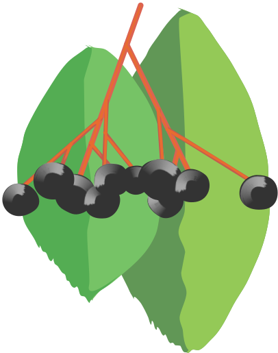

[![npm version][npm-shield]][npm-url]
[![MIT License][license-shield]][license-url]


<!-- PROJECT LOGO -->
<br />
<p align="center">
  

  <h3 align="center">RussianNounsJS</h3>

  <p align="center">
    A JavaScript library that declines nouns.
    <br />
    <br />
    <a href="https://georgy7.github.io/RussianNounsJS/">View Demo</a>
    ·
    <a href="https://georgy7.github.io/RussianNounsJS/testing.html">Run Tests</a>
    ·
    <a href="https://github.com/georgy7/RussianNounsJS/issues">Report Bug</a>
    ·
    <a href="https://github.com/georgy7/RussianNounsJS/wiki">Wiki</a>
  </p>
</p>


<!-- TABLE OF CONTENTS -->
<details open="open">
  <summary>Table of Contents</summary>
  <ol>
    <li>
      <a href="#installation">Installation</a>
      <ul>
        <li><a href="#frontend">Frontend</a></li>
        <li><a href="#backend">Backend</a></li>
      </ul>
    </li>
    <li>
      <a href="#usage">Usage</a>
      <ul>
        <li><a href="#the-basics">The basics</a></li>
        <li><a href="#stress-dictionary-tuning">Stress dictionary tuning</a></li>
        <li><a href="#a-complex-example">A complex example</a></li>
      </ul>
    </li>
    <li><a href="#limitations">Limitations</a></li>
    <li><a href="#references">References</a></li>
  </ol>
</details>


## Installation

### Frontend

```html
<script src="RussianNouns.js"></script>
```

or (without [AMD](https://en.wikipedia.org/wiki/Asynchronous_module_definition))

```html
<!-- from the same domain -->
<script type="module" src="myscript.js"></script>
```

```js
import 'RussianNouns.js';
```

or (in a Web Worker)

```js
importScripts('RussianNouns.js');
```

### Backend

```
npm i --save russian-nouns-js
```

```js
const RussianNouns = require('russian-nouns-js');
```

For TypeScript, there are
[type definitions](https://www.npmjs.com/package/@types/russian-nouns-js)
[written by Alexander Semin](https://github.com/RusAnonym/DefinitelyTyped/tree/master/types/russian-nouns-js).

## Usage

### The basics

```js
const rne = new RussianNouns.Engine();

// Grammatical gender is a sort of noun class, related primarily to their sound.
// Although mostly native speakers just remember them.

const Gender = RussianNouns.Gender;
const Case = RussianNouns.Case;


rne.decline({text: 'имя', gender: Gender.NEUTER}, Case.GENITIVE);
// ◂ [ "имени" ]

rne.decline({text: 'имя', gender: Gender.NEUTER}, Case.INSTRUMENTAL);
// ◂ [ "именем" ]


// A number of loan words are not declined.
// You should explicitly state this to prevent inflection.

let coat = RussianNouns.createLemma({
    text: 'пальто',
    gender: Gender.NEUTER,
    indeclinable: true
});

rne.decline(coat, Case.GENITIVE);
// ◂ [ "пальто" ]

RussianNouns.getDeclension(coat);
// ◂ -1


// Cases can be specified not only by name, but also by number.
// In the usual order: NOM, GEN, DAT, ACC, INS, PREP.
// And there is also the locative case as the seventh.
// It usually matches the prepositional one.

let mountain = RussianNouns.createLemma({
    text: 'гора',
    gender: Gender.FEMININE
});

RussianNouns.CASES.map(c => {
    return rne.decline(mountain, c);
});

// ◂ [
//     ["гора"]
//     ["горы"]
//     ["горе"]
//     ["гору"]
//     ["горой", "горою"]
//     ["горе"],
//     ["горе"]
// ]


// This is how you can get a plural form in the nominative case.

rne.pluralize(mountain);
// ◂ [ "горы" ]


// When you have the plural form in the nominative case, pass it
// as the third argument of the decline function to decline in plural.

RussianNouns.CASES.map(c => {
    return rne.decline(mountain, c, 'горы');
});

// ◂ [ 
//     [ 'горы' ]
//     [ 'гор' ]
//     [ 'горам' ]
//     [ 'горы' ]
//     [ 'горами' ]
//     [ 'горах' ]
//     [ 'горах' ]
// ]


// For words that are used only in plural, the original form
// of the word is the plural form in the nominative case.
// You should also explicitly state this.
// The concept of grammatical gender doesn't make sense for such words.

let scissors = RussianNouns.createLemma({
    text: 'ножницы',
    pluraleTantum: true
});

rne.pluralize(scissors);
// ◂ [ 'ножницы' ]

RussianNouns.CASES.map(c => {
    return rne.decline(scissors, c);
});

// ◂ [
//     [ 'ножницы' ]
//     [ 'ножниц' ]
//     [ 'ножницам' ]
//     [ 'ножницы' ]
//     [ 'ножницами' ]
//     [ 'ножницах' ]
//     [ 'ножницах' ] 
// ]
```

### Stress dictionary tuning

```js
let кринж = RussianNouns.createLemma({
    text: 'кринж',
    gender: Gender.MASCULINE
});

const rne = new RussianNouns.Engine();

rne.decline(кринж, Case.INSTRUMENTAL);  // ◂ [ "кринжем" ]

// Change of stresses.
// Before the hyphen, there are singular settings.
// After the hyphen are the plural settings.
// The letter number in the settings is the case number in CASES.
// S — Stress is on the stem only.
// s — Stress is more often on the stem.
// b — Stress can be both on the stem and the ending equally.
// e — Stress is more often on the ending.
// E — Stress is on the ending only.
rne.sd.put(кринж, 'SEESESE-EEEEEE');

rne.decline(кринж, Case.INSTRUMENTAL);  // ◂ [ "кринжом" ]

rne.sd.put(кринж, 'SEESbSE-EEEEEE');
rne.decline(кринж, Case.INSTRUMENTAL);  // ◂ [ "кринжем", "кринжом" ]

rne.sd.put(кринж, 'SEESsSE-EEEEEE');
rne.decline(кринж, Case.INSTRUMENTAL);  // ◂ [ "кринжем", "кринжом" ]

rne.sd.put(кринж, 'SEESeSE-EEEEEE');
rne.decline(кринж, Case.INSTRUMENTAL);  // ◂ [ "кринжом", "кринжем" ]
```

### A complex example

```js
const Gender = RussianNouns.Gender;
const createLemma = RussianNouns.createLemma;

const rne = new RussianNouns.Engine();

function usual(lemma, caseNumber) {
    const c = RussianNouns.CASES[caseNumber - 1];
    return rne.decline(lemma, c)[0];
}

// To get a little-used or older form.
function unusual(lemma, caseNumber) {
    const c = RussianNouns.CASES[caseNumber - 1];
    const result = rne.decline(lemma, c);
    return result[result.length - 1];
}

function plural(lemma, caseNumber) {
    const c = RussianNouns.CASES[caseNumber - 1];
    const pluralForm = rne.pluralize(lemma)[0];
    return rne.decline(lemma, c, pluralForm)[0];
}

function cap(str) {
    return str[0].toUpperCase() + str.substring(1);
}

// -----------------------------------------------

// Александр Сергеевич Пушкин
// Зимний вечер (фрагмент)

const буря = createLemma({text: 'буря', gender: Gender.FEMININE});
const мгла = createLemma({text: 'мгла', gender: Gender.FEMININE});
const небо = createLemma({text: 'небо', gender: Gender.NEUTER});
const зверь = createLemma({text: 'зверь', gender: Gender.MASCULINE, animate: true});
const дитя = createLemma({text: 'дитя', gender: Gender.NEUTER, animate: true});
const солома = createLemma({text: 'солома', gender: Gender.FEMININE});
const окошко = createLemma({text: 'окошко', gender: Gender.NEUTER});

const снежный = createLemma({text: 'снежный', gender: Gender.MASCULINE});
const вихрь = createLemma({text: 'вихрь', gender: Gender.MASCULINE});

const обветшалая = createLemma({text: 'обветшалая', gender: Gender.FEMININE});
const кровля = createLemma({text: 'кровля', gender: Gender.FEMININE});

const запоздалый = createLemma({text: 'запоздалый', gender: Gender.MASCULINE, animate: true});
const путник = createLemma({text: 'путник', gender: Gender.MASCULINE, animate: true});

console.log(`${cap(usual(буря, 1))} ${unusual(мгла, 5)} ${usual(небо, 4)} кроет,
${cap(plural(вихрь, 4))} ${plural(снежный, 4)} крутя;
То, как ${usual(зверь, 1)}, она завоет,
То заплачет, как ${usual(дитя, 1)},
То по ${usual(кровля, 3)} ${usual(обветшалая, 3)}
Вдруг ${usual(солома, 5)} зашумит,
То, как ${usual(путник, 1)} ${usual(запоздалый, 1)},
К нам в ${usual(окошко, 4)} застучит.`);

// Буря мглою небо кроет,
// Вихри снежные крутя;
// То, как зверь, она завоет,
// То заплачет, как дитя,
// То по кровле обветшалой
// Вдруг соломой зашумит,
// То, как путник запоздалый,
// К нам в окошко застучит.

// -----------------------------------------------

// Николай Степанович Гумилев
// Рассказ девушки (фрагмент)

const ворота = createLemma({text: 'ворота', pluraleTantum: true});
const тень = createLemma({text: 'тень', gender: Gender.FEMININE});
const снег = createLemma({text: 'снег', gender: Gender.MASCULINE});

const милая = createLemma({text: 'милая', gender: Gender.FEMININE});
const старая = createLemma({text: 'старая', gender: Gender.FEMININE});
const ель = createLemma({text: 'ель', gender: Gender.FEMININE});

const неведомая = createLemma({text: 'неведомая', gender: Gender.FEMININE});
const высота = createLemma({text: 'высота', gender: Gender.FEMININE});

console.log(`* * *
Я отдыхала у ${plural(ворота, 2)}
Под ${usual(тень, 5)} ${usual(милая, 2)}, ${usual(старая, 2)} ${usual(ель, 2)},
А надо мною пламенели
${cap(plural(снег, 1))} ${plural(неведомая, 2)} ${plural(высота, 2)}.`);

// * * *
// Я отдыхала у ворот
// Под тенью милой, старой ели,
// А надо мною пламенели
// Снега неведомых высот.
```

## Limitations

This library does not prevent you from misusing the [singularia tantum](https://en.wikipedia.org/wiki/Plurale_tantum#Singulare_tantum).

## References
- Современный русский язык. Морфология - Камынина А.А., Уч. пос. 1999 - 240 с.
- [Russian grammar (English Wikipedia)](http://en.wikipedia.org/wiki/Russian_grammar)
- [OpenCorpora (Russian text corpus)](http://opencorpora.org/)
- К семантике русского локатива ("второго предложного" падежа) - Плунгян В. А., Семиотика и информатика. - Вып. 37. - М., 2002. - С. 229-254

Please [take the survey](https://docs.google.com/forms/d/e/1FAIpQLSeZgtDuRFQhl7bX-i_6E5hJRhyzdxhPmf3ZVBNJh3tUD6cBVg/viewform?usp=sf_link)
to make this library better.


<!-- MARKDOWN LINKS & IMAGES -->
<!-- https://www.markdownguide.org/basic-syntax/#reference-style-links -->
[npm-shield]: https://img.shields.io/npm/v/russian-nouns-js.svg?style=for-the-badge
[npm-url]: https://www.npmjs.com/package/russian-nouns-js
[license-shield]: https://img.shields.io/github/license/georgy7/RussianNounsJS.svg?style=for-the-badge
[license-url]: https://github.com/georgy7/RussianNounsJS/blob/release/LICENSE.txt
