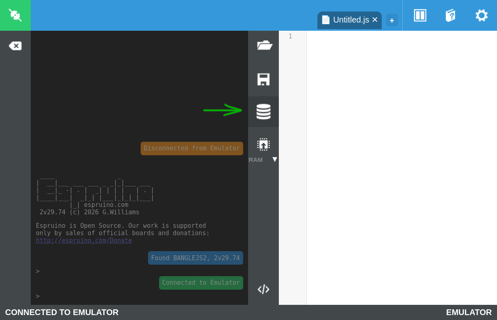
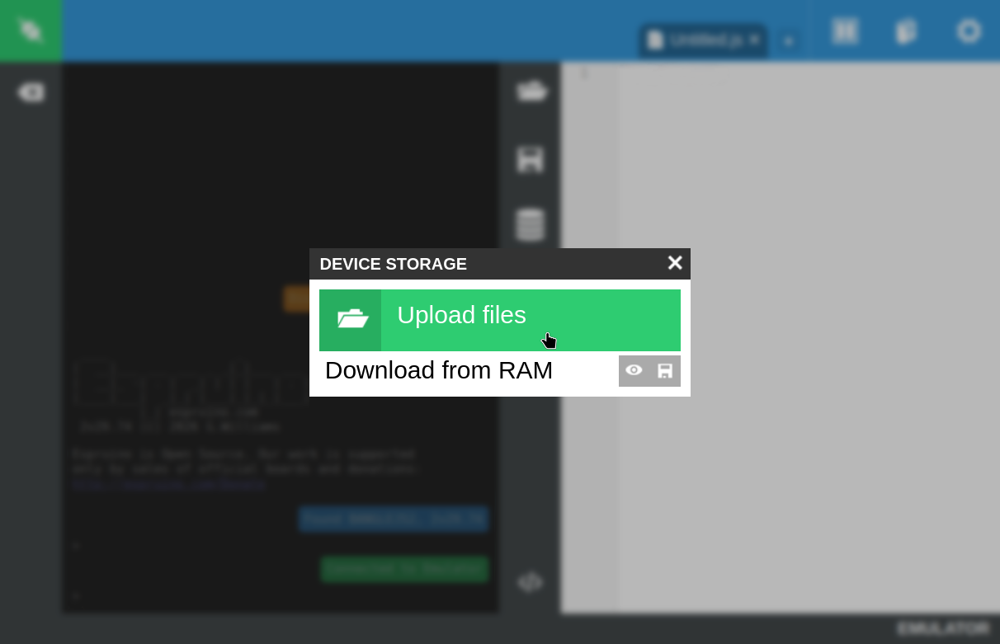
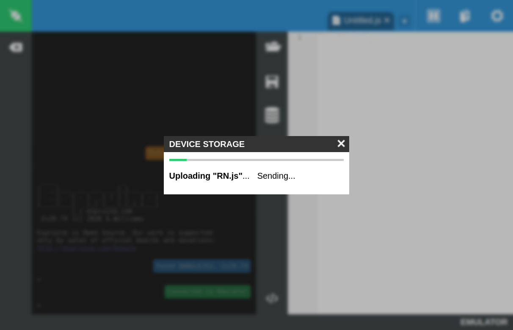

# Эксперименты и исследования

Эта ветка очень важна для сопровождения библиотеки RussianNounsJS, но, будучи нагромождением
стороннего кода и данных, не может считаться её частью из-за огромного размера и несовместимых
лицензий.

Никогда не вливайте эту ветку в `release` или `next`.

## 1. Тестирование на данных из корпуса

Пожалуй, самая ценная возможность, предоставляемая этой веткой — возможность проверить
библиотеку на огромном словаре.

Соберите с помощью Rollup (`npm run build`) ту версию библиотеки, которую хотите
протестировать. У вас обновятся файлы в папке `dist/`.
Скопируйте эти файлы сюда, в папку `js/dist/`.

### Веб-версия

Запустите `serve-with-ruby.rb`.
Скрипт поднимет сервер на `9090`.

- <http://localhost:9090/testing.html#/prof> 
  выполняется в основном потоке окна,
  что полезно для профилирования и отладки
- <http://localhost:9090/testing.html> 
  задействует несколько потоков,
  чтобы показать результат как можно быстрее

### Интерфейс командной строки

Запустите `node js/runTests.js` чтобы вывести итоги тестирования в консоль.
Вы также можете добавить опцию `--logs` чтобы получить `all_errors.log`
и `frequent_errors.log` (слова, которые встречаются в частотном словаре).
Поскольку слова идут по алфавиту, логи удобно сравнивать.

Не требует сервера и браузера — удобно для ИИ-агентов.

---

## 2. Подготовка данных

В библиотеке, из соображений компактности (в основном), есть наборы слов, представленные
в виде сжатых дельта-кодированием хэш-сумм — `settings/stressHashes.js`.
Эти массивы чисел из наборов слов создаются в этой ветке, и проще всего их редактировать
здесь, а затем, в виде чисел, копировать в библиотеку.

Этим занимается скрипт `js/hashMaker.js` и веб-страница `hash.html` (не требует веб-сервер).

Когда я последний раз проверял, скрипт работал только в браузере,
хотя это скорее случайность, там нет чего-то принципиально невозможного в NodeJS.
Этот скрипт просто выводит наборы чисел с помощью `console.log`.

---

## 3. Поддержка Espruino

Библиотека работает в эмуляторе Bangle.js 2.
Не в Юникоде, конечно. И это не покрыто тестами вообще.

    cd js/
    ./prepareForEspruino.sh

Скрипт конвертирует библиотеку в кодировку CP1251
и, объединив с минимальным полифилом, пишет в файл `RN.js`.

Откройте **[Espruino Web IDE](https://www.espruino.com/ide/)** и загрузите `RN.js`
в Storage (флеш-память микроконтроллера). Espruino умеет интерпретировать JS-код
непосредственно оттуда, что позволяет использовать такие тяжёлые
библиотеки на микроконтроллерах с двенадцатью килобайтами ОЗУ.

Теперь вы можете использовать её как модуль.

    const RussianNouns = require('RN.js');

Еще раз напоминаю, что Espruino не поддерживает Юникод.
Смотрите пример использования в однобайтовой кодировке в файле `js/Espruino_example.js`.

---

## 4. Поддержка MS-DOS

Поскольку ES5-версия библиотеки с полифилом [core-js](https://github.com/zloirock/core-js)
вполне сносно работает во встраиваемых движках [Duktape](https://duktape.org/) и [MuJS](https://codeberg.org/ccxvii/mujs),
она работает и в среде MS-DOS
с помощью [jSH](https://github.com/SuperIlu/jSH)
и [DOjS](https://github.com/SuperIlu/DOjS),
которые как раз основаны на MuJS.

В этой ветке (`js/dos/`) вы найдёте наброски скриптов для отображения кириллицы
в консоли в режиме [кодовой страницы 866](https://ru.wikipedia.org/wiki/CP866).

